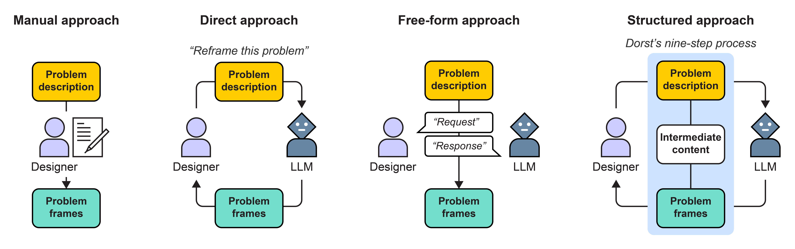

# No Evidence for LLMs Being Useful in Problem Reframing



<br>

<ul style="margin-bottom: 20px;">
    <li style="margin-bottom: 10px;">In this project, we studied the benefits and drawbacks of using LLMs in problem reframing.</li>
    <li style="margin-bottom: 10px;">We tested three approaches to use LLMs in problem reframing compared to a not using LLMs:</li>
        <ul>
            <li style="margin-bottom: 10px;"><i>Direct approach</i>: Prompting an LLM directly to generate alternative problem frames.</li>
            <li style="margin-bottom: 10px;"><i>Free-form approach</i>: Conversing with an LLM as needed in reframing problems.</li>
            <li style="margin-bottom: 10px;"><i>Structured approach</i>: Prompting an LLM to generate the entire content throughout Kees Dorst's nine-step reframing process.</li>
        </ul>
    <li style="margin-bottom: 10px;">In this repository, use can test the Direct and Structured approach (we tested the Free-form approach using ChatGPT).</li>
    <li style="margin-bottom: 10px;">This project is published at CHI'25 <a href="https://doi.org/10.1145/3706598.3713273">(paper)</a> <a href="https://joongishin.github.io/problemReframing_llm/">(project page)</a></li>
</ul>

<br>

## Setup

First, you need an OpenAI API key. If you do not have one, follow [Developer quickstart](https://platform.openai.com/docs/quickstart) from OpenAI to create your own.

1. Download our repository.
2. Install libraries (we tested with [Python 3.10.2](https://www.python.org/downloads/release/python-3102/)).
```
pip install -r requirement.txt
```
3. Create config.env in the root folder to set your OpenAI API key. In the file, add your key as shown below.
```
OPENAI_API_KEY=your-OpenAI-API-Key
```
4. All set. Follow the usage below to try our workflows.

<br>

## Usage
We provide [example design problems](./data/design_problems.csv). Update the file, if you wish to use your own design problems.
```

```
<br>

### Direct approach
Run [direct_approach.py](./direct_approach.py)
<br>

### Structured approach
Run [structured_approach.py](./structured_approach.py)
<br>


## Bibtext
```bibtex
@inproceedings{shin:2025:problemReframingLLM,
    title={No Evidence for LLMs Being Useful in Problem Reframing},
    author = {Shin, Joongi and Polyanskaya, Anna and Lucero, Andrés and Oulasvirta, Antti},
    publisher = {Association for computing Machinery},
    booktitle = {Proceedings of the 2025 CHI Conference on Human Factors in Computing Systems},
    year={2025},
    url={https://doi.org/10.1145/3706598.3713273},
    doi={10.1145/3706598.3713273}
}
```